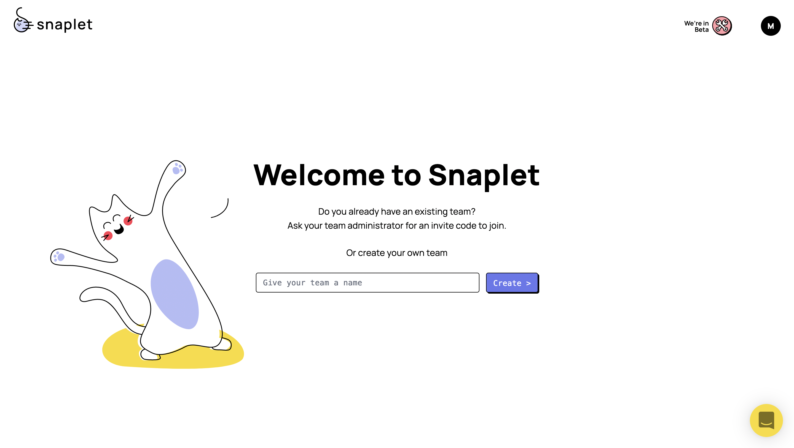
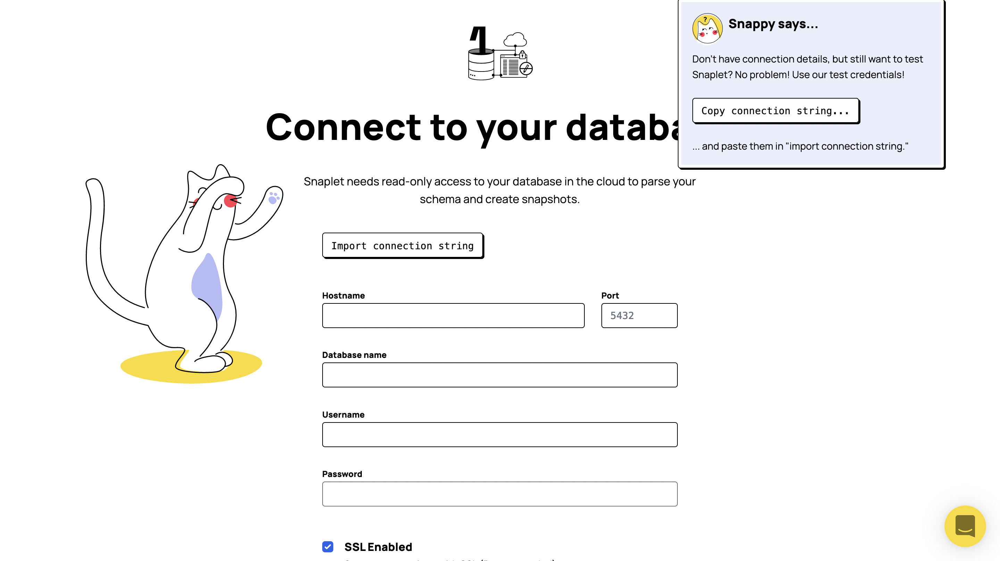
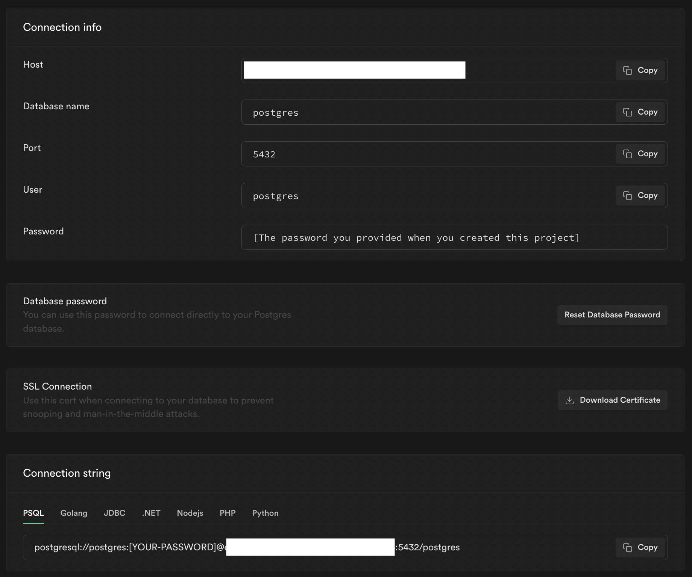
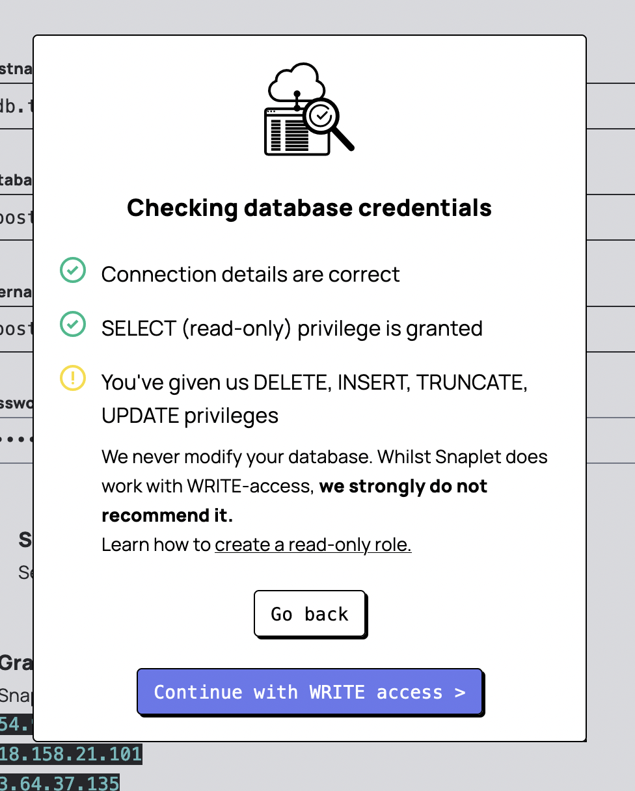
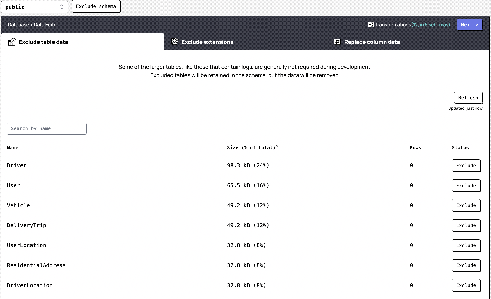
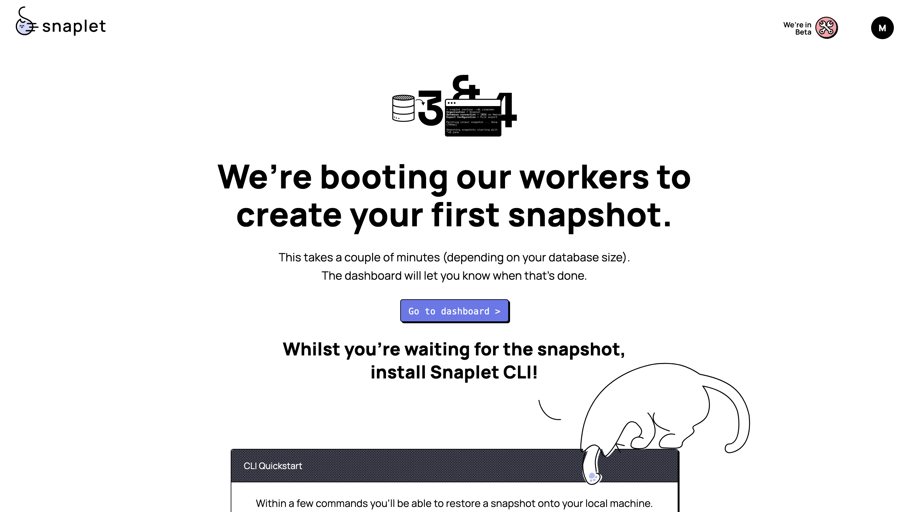

# Supabase Integration Guide
## Clone Supabase production data, without personal information, to a development environment

We're massive fans of [Supabase](https://supabase.com/) here at Snaplet, but as a Supabase user, you’ll know the pain and manual configuration in setting up multiple environments on Supabase, and populating each of those with data. Snaplet makes populating your multiple development environments with data, and keeping that data consistent across those environments, incredibly simple. This is rooted in a philosophy we believe in here at Snaplet: Environment parity.

"Environment parity" is a term introduced by ["The 12 Factor App Methodology"](https://12factor.net/dev-prod-parity) that instructed developers to keep our environments as similar as possible so that we could have the confidence that if it “worked on my machine,” it would work in production:

> If your development, testing, and production environments differ, even in ways you might think don’t matter, then you lose the ability to accurately predict how your code change is going to behave in production. This confidence in the code heading to production is essential for the kind of continuous delivery, rapid deployment that allows applications and their development teams to thrive in the cloud. – [Kevin Hoffman](https://www.oreilly.com/content/environment-parity-for-rapidly-deployed-cloud-native-apps/)

Environment parity sounds like a dream come true. In this guide, we’re going to tell you exactly how to do that with your data in Supabase! End-to-end, it shouldn’t take more than 15 minutes, and doing so will allow you to code against an accurate development environment that you can periodically sync with production. Chef's kiss!

You can follow along in the video below as our founder, Peter Pistorius takes you through the entire process, or refer to the written guide below.

<iframe src="https://www.youtube.com/embed/oPtMMhdhEP4?rel=0" frameborder="0" allow="accelerometer; autoplay; encrypted-media; gyroscope; picture-in-picture; modestbranding; showinfo=0" allowfullscreen></iframe>

### Things you'll need before you begin:
1. **A production Supabase project's connection string:** These can be found in Supabase via Organization > Project > Database > Connection Pooling > Connection string
2. **A development Supabase project's connection string:** Same steps as above, but a different project/environment
3. **A read-only role** in Production (recommended): This can be done by running the following statements on Supabase via `Organization > SQL Editor > + New Query`

```sql
-- Create a `read_all_data` role on all schemas
CREATE ROLE snaplet_read_all_data;

DO $do$
DECLARE
    sch text;
BEGIN
    FOR sch IN SELECT nspname FROM pg_namespace
    LOOP
        EXECUTE format($$ GRANT USAGE ON SCHEMA %I TO snaplet_read_all_data $$, sch);
				EXECUTE format($$ GRANT SELECT ON ALL TABLES IN SCHEMA %I TO snaplet_read_all_data $$, sch);
				EXECUTE format($$ ALTER DEFAULT PRIVILEGES IN SCHEMA %I GRANT SELECT ON TABLES TO snaplet_read_all_data $$, sch);
    END LOOP;
END;
$do$;

-- Create a `snaplet` user and associate the `read_all_data` role.
CREATE USER snaplet WITH PASSWORD 'a very good password';
GRANT snaplet_read_all_data TO snaplet;
```
4. **Superuser access** for the development project. This can be done in Supabase via `Organization > SQL Editor > + New Query` and running this statement:
   `ALTER USER postgres WITH superuser;`

### Step 1: Connect your data source
The first thing you’ll want to do is navigate to [https://www.snaplet.dev/](https://www.snaplet.dev/) and sign up for a new account (it’s free). Once you have successfully signed up for a new account, you’ll begin the onboarding process...






You’ll then want to enter the credentials of your production Supabase project. Find the "Connection string" in Supabase via `Organization > Project > Settings > Database > Connection string` (At the bottom of the page.)

Remember that the password is the same password you used when creating the Supabase project.




You’ll then have to confirm providing Snaplet access to your database. Snaplet will prompt you to only provide `read-only` access to your database. We have a guide in our documentation on how to go about this and you can check that out [here](https://docs.snaplet.dev/postgresql/create-read-only-role).

> Note that whatever connection string you provide here will be that of your `Data Source` – essentially the production database in a real-life scenario




Once you have configured this or are comfortable with continuing with `WRITE` access, you can continue. 

### Step 2: Transform your data



Here, you are going to want to exclude any schemas that you do not require. You are able to exclude an entire schema by click on the drop-down at the top, selecting the schema you would like to exclude and clicking ‘Exclude schema’. Alternatively, you can select a given schema and exclude only specific tables from that particular schema. Exclude any non-required table data (such as logs) and extensions and view your columns. 

At this point, Snaplet will automatically detect any columns that have Personally Identifiable Information (PII) and mark them in purple. If there are any additional columns that hold data you would like to anonymise, you can click on the respective column name and provide a replacement value for the data in that column. Once you are happy and satisfied, you can click on `Review and Save`  and proceed to the dashboard.




### Step 3: Create a Snapshot
Next you’ll want to create a snapshot of your production database. This is what you’re going to restore later into your data target (more on that later in the guide).

### Step 4: Create a data target on Supabase
Your data target is essentially where you want Snaplet to restore the data from your production database into. To put it into context, this would most likely be either your staging or developer database.

If you don’t already have a developer database setup on Supabase, you’ll need to create a new data target by setting up a new project on Supabase. To create a new project you’ll have to do the following:

1. Go to [app.supabase.io](https://app.supabase.io)
2. Click on “new project”
3. Enter your project details
4. Wait for the new database to launch

> Remember the password you use when creating the project. You’ll need this password to connect your database to Snaplet later. 

### Step 5: Make yourself a superuser on the data target
Granting superuser privileges is important because without it, the data restoration will fail. If you try to restore the snapshot from your data source without granting superuser privileges to your `postgres` user, you will run into an `Unhandled error: must be owner of schema storage` . So in order to grant these privileges you’ll want to:

1. Navigate to your the `SQL Editor` in your Supabase console
2. Click on `new query`
3. Paste `alter user postgres with superuser;` into the SQL editor
4. Run the query

### Step 6: Install the Snaplet CLI
1. Open your terminal and run `curl -sL [https://app.snaplet.dev/get-cli/](https://app.snaplet.dev/get-cli/) | bash`
2. Run `snaplet auth`
3. Navigate to [`https://app.snaplet.dev/access-token/cli`](https://app.snaplet.dev/access-token/cli) to get your access token
4. Paste your access token in the terminal

### Step 7: Restore to the data target
If you have made it this far, you are ready to now populate your data target with some anonymised, versioned and production-like data.

1. Navigate to your project directory
2. Run `snaplet setup` – you will be prompted to enter your database credentials. These are the database credentials of your **data target.** This could be your staging or development database

Once you have successfully completed the above steps, you will have be presented with a list of options – these options are databases that are connected to your Snaplet account.

1. Select a data source from the list
2. Run `snaplet restore`

At this point in time, your specified data target should have a tables populated with anonymised, versioned and production-like data.


As a Supabase user, you can see how this solves an issue we all typically experience when attempting to create multiple development environments and populating each of those environments with data that you can work with. With Snaplet, this workflow is simplified down to creating the respective Supabase projects, connecting the data source (typically the production database) to Snaplet and then telling Snaplet where to restore that data (typically your staging and development databases).

Usually, populating your staging and development databases can be a pain, but it doesn’t have to be. With Snaplet that workflow becomes much easier. All you have to worry about is creating a new project on Supabase and let Snaplet worry about getting your data in there.

If you want to learn more about Snaplet, you can explore our [docs](https://docs.snaplet.dev/). If you have any questions, feel free to [reach out on Discord](https://discord.com/invite/6HUuajc866) .


